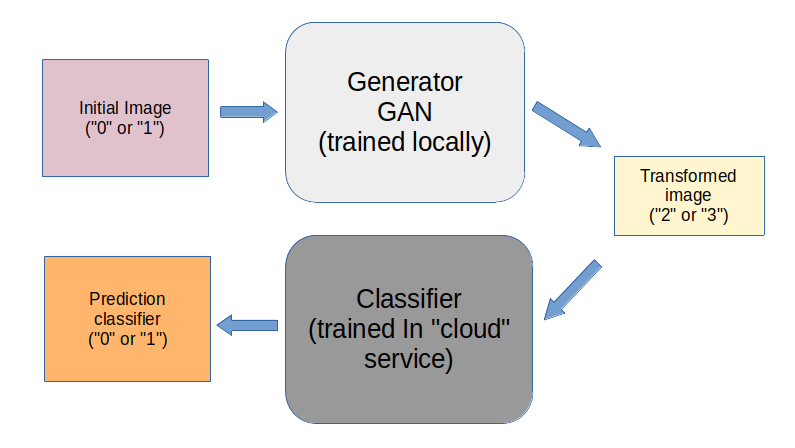

  

<h1 align="center">
  Protection of data semantics when training neural networks in clouds
</h1>

## Data-Semantics-Protector &middot;       ##

This repository contains the code of a project designed to enable the training of artificial neural networks in the clouds without the need to expose the semantics of the data used for training.

The idea behind this project is as follows:
- There is a real data set on which it is necessary to train `NN`. Suppose in this dataset there are `2 classes` of images `"0"` and `"1"`. Our task is to get a neural network trained to solve a problem related to these data, however, the owner of the remote computing equipment should not know on which image classes the training takes place.
- It is proposed to train locally `NN-GAN`, which will transform one class of images into another (which we can already disclose to the owner of the remote computing equipment). In this implementation, `GAN` will translate `"0"->"2"`, `"1"->"3"`. `"0"`, `"1"` are the classes we want to hide, `"2"`, `"3"` are the ones we can reveal.
- Next, convert all data from the original dataset using the trained `GAN` network (to get a "false" dataset from `"2"` and `"3"`).
- Next, train the model (in this project it is a classifier model) in a cloud computing service (for example, `Google Colab`) on a "false" dataset. This model will answer the question "does this image belong to `"2"` or `"3"`?"
- Then, we can organize a pipeline of `NNs`, allowing the use of a locally trained `GAN` (`"0"->"2"`, `"1"->"3"`) and a remotely trained classifier network `"2"` and `"3"` to solve the problem of classifying the INITIAL classes `"0"` and `"1"`. The idea is shown in the figure below:

  

 

_Note: it makes sense to use such a pipeline only when a neural network trained in the cloud is more complicated than a neural network trained on a local machine._
_In this project, this is not the case, because it is much more difficult to train the generator than the image classifier, however, for ease of explaining the idea of ​​​​the project, these networks were chosen (only for demonstration purposes)_
## :computer: Getting Started  ##

In `Google Colab` it is necessary, according to the numbering of directories, to run the source code contained in them in the `Python` programming language. In this case, it is necessary to create directories with appropriate names, etc. (only in a few places, see related code!). The training data is presented in the [Datasets](./Datasets) directory.

### :bookmark_tabs: Licence ###
Data-Semantics-Protector is [CC BY-NC-SA 3.0 licensed](./LICENSE).
